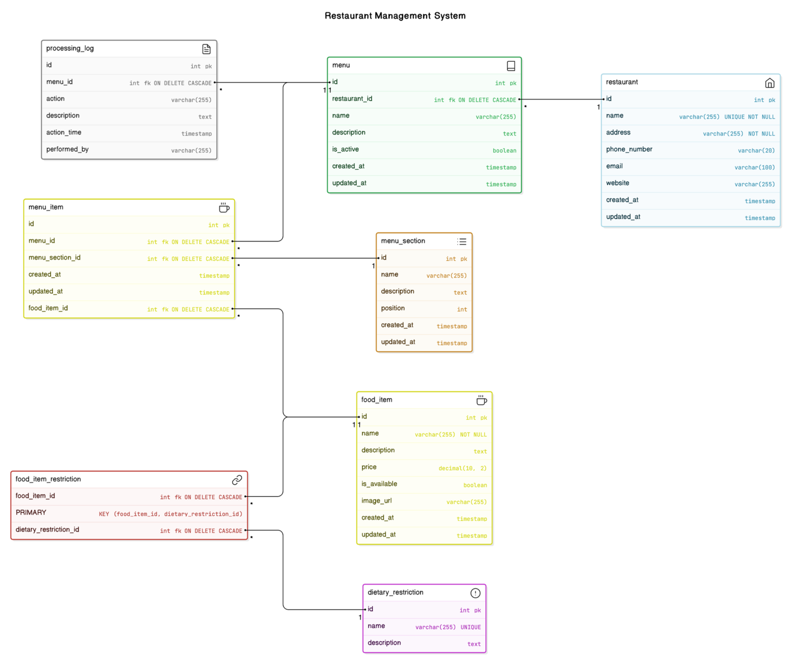

# Restaurant Management System
## Software Design Document

**Name**: [Group 9]  
**Date**: [5/12/2024]  

---

## Summary

- [1 Introduction](#1-introduction)
- [2 System Overview](#2-system-overview)
- [3 System Architecture](#3-system-architecture)
- [4 Data Design](#4-data-design)
- [5 Component Design](#5-component-design)
- [6 Human Interface Design](#6-human-interface-design)
- [7 Requirements Matrix](#7-requirements-matrix)
- [8 Appendices](#8-appendices)

---

## 1 Introduction

### 1.1 Purpose
The purpose of this Software Design Document (SDD) is to provide a detailed description of the design and architecture of the Restaurant Management System. This document is intended for developers, designers, and stakeholders to ensure a clear understanding of the system's design, functionality, and implementation.

### 1.2 Scope
The Restaurant Management System is designed to manage restaurant operations, including menus, food items, dietary restrictions, and logging changes. The system supports multiple restaurants, shared menus, and detailed categorization of menu sections and food items. Key objectives include flexibility, scalability, and maintaining data integrity.

### 1.3 Overview
This document details the system's architecture, data design, and components. It also describes the user interface design and requirements traceability.

### 1.4 Reference Material
1. Database Schema and Design Justification Report  
2. Software Requirements Specification (SRS) Document

### 1.5 Definitions and Acronyms
- **ERD**: Entity Relationship Diagram  
- **SDD**: Software Design Document  
- **SRS**: Software Requirements Specification  

---

## 2 System Overview

The Restaurant Management System enables restaurant owners to manage their menus, food items, and dietary restrictions efficiently. It allows multiple restaurants to share menus and organize offerings into logical sections. The system includes support for auditing changes and ensuring scalability for multi-location operations.

---

## 3 System Architecture

### 3.1 Architectural Design
The system is designed using a modular architecture to separate key functions into subsystems. Major components include:
- **Restaurant Subsystem**: Manages restaurant data such as names, addresses, and contact information.
- **Menu Subsystem**: Handles menus, menu sections, and their assignments to restaurants.
- **Food Item Subsystem**: Manages food items, their categorization, and dietary restrictions.
- **Audit Subsystem**: Logs changes to menus for accountability.

#### **Diagram**  
- **Restaurant Subsystem** ↔ **Menu Subsystem** ↔ **Menu Section Subsystem** ↔ **Food Item Subsystem** ↔ **Dietary Restriction Subsystem**

### 3.2 Decomposition Description
The system consists of:
- **Data Layer**: Relational database schema including `restaurant`, `menu`, `menu_section`, `food_item`, and `dietary_restriction`.
- **Business Logic Layer**: Includes modules for CRUD operations on menus, food items, and sections.
- **User Interface Layer**: Provides a user-friendly interface for restaurant owners and staff.

### 3.3 Design Rationale
This modular design ensures scalability, reusability, and maintainability. Other designs, such as using flat tables for menus and food items, were avoided due to poor scalability and potential data duplication.

---

## 4 Data Design

### 4.1 Data Description
The database schema is highly normalized:
- **Key Tables**: `restaurant`, `menu`, `menu_section`, `food_item`, `dietary_restriction`
- **Junction Tables**: `restaurant_menu`, `food_item_restriction`

### 4.2 Data Dictionary
| **Entity**              | **Attributes**                                                                 |
|--------------------------|-------------------------------------------------------------------------------|
| `restaurant`             | `id`, `name`, `address`, `phone_number`, `email`, `website`, `created_at`, `updated_at` |
| `menu`                   | `id`, `name`, `description`, `is_active`, `created_at`, `updated_at`         |
| `menu_section`           | `id`, `name`, `description`, `position`, `created_at`, `updated_at`          |
| `food_item`              | `id`, `name`, `description`, `price`, `is_available`, `image_url`, `created_at`, `updated_at` |
| `dietary_restriction`    | `id`, `name`, `description`                                                  |
| `restaurant_menu`        | `restaurant_id`, `menu_id`                                                   |
| `food_item_restriction`  | `food_item_id`, `dietary_restriction_id`                                      |
| `processing_log`         | `id`, `menu_id`, `action`, `description`, `action_time`, `performed_by`      |

---

## 5 Component Design

| **Component**             | **Description**                                                                                             |
|---------------------------|-------------------------------------------------------------------------------------------------------------|
| `RestaurantManager`       | Manages CRUD operations for `restaurant` entities.                                                         |
| `MenuManager`             | Handles creation, modification, and deletion of menus, including their associations with restaurants.       |
| `FoodItemManager`         | Manages food items, including their assignments to menus and menu sections.                                 |
| `AuditManager`            | Tracks changes to menus via `processing_log`.                                                              |
| `DietaryRestrictionManager` | Handles operations related to dietary restrictions and their assignments to food items.                     |

---

## 6 Human Interface Design

### 6.1 Overview of User Interface
The system provides an intuitive dashboard for restaurant owners to:
- Create and manage menus.
- Assign menus to multiple restaurants.
- Categorize menus into sections and add food items.

### 6.2 Screen Images
Screens include:
1. **Dashboard**: Overview of restaurants and their menus.
2. **Menu Editor**: Create and edit menus, sections, and food items.
3. **Logs**: View actions performed on menus (e.g., updates or deletions).

### 6.3 Screen Objects and Actions
- **Button: "Add Menu"**: Opens a form to create a new menu.
- **Dropdown: "Select Restaurant"**: Associates a menu with multiple restaurants.
- **Table: "Menu Sections"**: Displays and organizes menu sections dynamically.

---

## 7 Requirements Matrix

| **Requirement ID** | **Description**                                           | **Component**                   |
|--------------------|-----------------------------------------------------------|---------------------------------|
| R1                 | Create and manage restaurants                             | `RestaurantManager`            |
| R2                 | Manage many-to-many relationship between menus and restaurants | `MenuManager`                  |
| R3                 | Manage food items and assign them to menus and sections   | `FoodItemManager`              |
| R4                 | Track menu changes for auditing purposes                  | `AuditManager`                 |
| R5                 | Handle dietary restrictions for food items                | `DietaryRestrictionManager`    |

---

## 8 Appendices

### **Appendix A: Entity Relationship Diagram (ERD)**

### **Appendix B: Acronyms**
- CRUD: Create, Read, Update, Delete  
- SRS: Software Requirements Specification  
- ERD: Entity Relationship Diagram  

---

